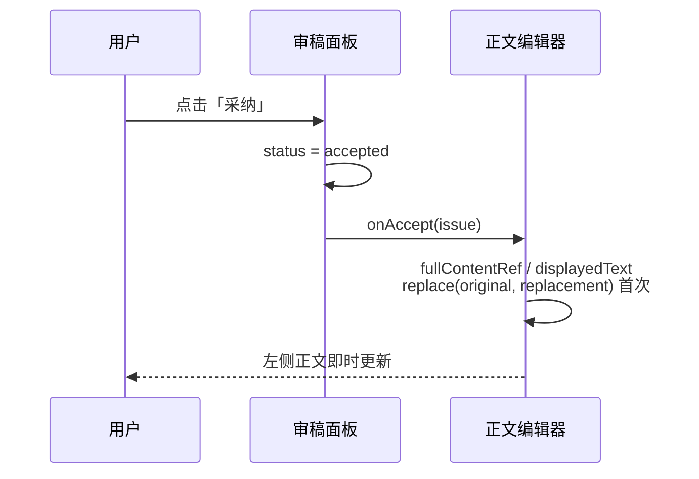

# 审稿核稿 — 产品需求文档（PRD）

| 项目 | 说明 |
|------|------|
| 产品模块 | 政策起草 · 政策输出页 · 右侧工具栏「审稿核稿」 |
| 版本 | v1.0（对应当前 `PolicyOutputPage` 实现） |
| 更新日期 | 2026-06-03 |
| 关联代码 | `src/components/policy-drafting/drafting/PolicyOutputPage.tsx` |

---

## 1. 背景与目标

### 1.1 背景

政策起草完成后，正文在发布前需经过**合规性**（敏感表述）、**规范性**（公文固定搭配）、**准确性**（错字错词）与**通顺性**（语法/标点）等维度的核验。人工通读成本高、易遗漏，需在编辑页内提供一站式「审稿核稿」能力。

### 1.2 产品目标

- 对当前政策全文进行自动扫描，按类型归类展示问题清单。
- 为每条问题提供**原文片段、建议修改、原因说明**，支持一键采纳或忽略。
- 采纳后**回写左侧正文**，减少二次编辑成本。
- 规则类检测**不依赖大模型**即可运行；配置 LLM 后增强错用字词与语法识别能力。

### 1.3 非目标（当前版本）

- 不提供审稿流程审批、多人协同批注、版本对比。
- 不替代法务终审；敏感词库为内置示例级词表，需运营持续维护。
- 正文「点击定位并高亮」为界面预留文案，**v1 尚未实现正文联动高亮**（见 §6.4）。

---

## 2. 用户与场景

| 角色 | 典型场景 |
|------|----------|
| 政策起草人员 | 生成/编辑政策正文后，打开审稿核稿，逐条处理敏感词与表述问题 |
| 核稿人员 | 对已有文稿执行「全文分析」，确认无固定搭配与语法硬伤后导出 |

**入口**：政策输出页 → **左侧**竖向工具栏 → 点击「审稿核稿」（`ShieldCheck` 图标）→ **右侧**滑出 360px 面板。

---

## 3. 功能架构

```mermaid
flowchart TB
  subgraph input [输入]
    A[政策正文 displayedText / fullContentRef]
  end

  subgraph detect [检测引擎 buildPolicyReviewIssues]
    B1[敏感词 · 词表子串匹配]
    B2[固定搭配 · 规则子串匹配]
    B3[错用字词 · 本地规则]
    B4[语法错误 · 本地规则 + 长规则优先]
    B5[错用/语法 · 大模型 LLM 可选]
    B6[语法 · 无 LLM 时标点重复兜底]
  end

  subgraph output [输出]
    C[问题列表 ProofreadIssue[]]
    D[右侧审稿面板]
  end

  subgraph action [用户操作]
    E[采纳 → 正文 replace]
    F[忽略 → 状态标记]
    G[全文分析 → 重新检测]
  end

  A --> B1 --> C
  A --> B2 --> C
  A --> B3 --> C
  A --> B4 --> C
  A --> B5 --> C
  A --> B6 --> C
  C --> D
  D --> E
  D --> F
  D --> G
  G --> detect
```

**检测顺序（固定）**：敏感词 → 固定搭配 → 本地错用字词 → 本地语法规则 → 大模型（错用/语法）→ 无 LLM 时的标点语法兜底。

**去重规则**：同一 `original` 字符串仅保留一条问题（`usedOriginals` Set）。语法类长规则优先于短规则：若已存在更长 `original` 且包含当前短片段，则跳过短规则报项。

---

## 4. 问题数据模型

| 字段 | 类型 | 说明 |
|------|------|------|
| `id` | string | 唯一标识，格式 `{type}-{序号}` |
| `type` | enum | `sensitive` \| `misused` \| `collocation` \| `grammar` |
| `title` | string | 展示用标题，与类型标签一致 |
| `original` | string | 正文中须**连续出现**的原文片段 |
| `replacement` | string | 建议替换后的片段（敏感词为引导性文案） |
| `reason` | string | 命中原因 / 修改说明 |
| `status` | enum | `pending`（待处理）\| `accepted`（已采纳）\| `ignored`（已忽略） |
| `isExample` | boolean? | 示例项，不可操作（预留） |

---

## 5. 错误类型与纠错逻辑

### 5.1 敏感词（`sensitive`）

#### 检测逻辑

| 项 | 说明 |
|----|------|
| 方式 | **本地词表子串匹配**：`content.includes(term)` |
| 数据源 | `sensitiveProofreadTerms[]`，每项 `{ term, reason }` |
| 大模型 | **不参与**敏感词检测 |
| 命中条件 | 正文中任意位置出现词表字符串即报一条 |

#### 当前词表（可运营扩展）

| 分类 | 词条示例 |
|------|----------|
| 涉政 | 台独、港独、藏独、疆独、颠覆国家政权 |
| 涉黄 | 色情、卖淫、裸聊 |
| 涉暴 | 暴力恐吓、血腥、恐怖袭击、**打架**、**斗殴** |

#### 纠错逻辑

| 项 | 说明 |
|----|------|
| `original` | 命中的敏感词本身（如「打架」） |
| `replacement` | 固定文案：**「请删除或替换为合规表述」**（非自动删词） |
| 采纳行为 | `正文.replace(original, replacement)`，**仅替换首次出现** |
| 产品建议 | 运营侧应引导用户手动改为合规表述；v2 可改为「删除该词」或「打开替换框」 |

#### 展示规范

- 类型色：红色左边框 / 红色计数
- 图标：`!`

---

### 5.2 错用字词（`misused`）

#### 检测逻辑（多通道，结果合并去重）

| 通道 | 条件 | 说明 |
|------|------|------|
| **本地规则** | `content.includes(wrong)` | `localMisusedWordRules[]`，不依赖 LLM |
| **大模型** | 已配置 `VITE_POLICY_LLM_*` | 见 §5.2.2 |

**本地规则示例（当前）**

| wrong | right | reason 要点 |
|-------|-------|-------------|
| 家快 | 加快 | 常见输入笔误 |

#### 5.2.2 大模型检测（可选）

| 项 | 说明 |
|----|------|
| 触发 | `isPolicyLlmConfigured() === true` |
| 范围 | 正文前 **5000** 字符 |
| 温度 | `0.1`（偏确定性） |
| 职责 | **仅**错用字词、语法；明确不查敏感词与固定搭配 |
| 输出 | JSON 数组，`type` 为 `misused` 或 `grammar` |
| 校验 | `original` 非空、与 `replacement` 不同、且 `content.includes(original)` |
| 失败 | 控制台告警，**不影响**已命中的规则类结果 |

**Prompt 关注点（已写入）**：相邻字笔误（家快→加快）、语序颠倒（政草策→政策草）、动宾搭配不当。

#### 纠错逻辑

| 项 | 说明 |
|----|------|
| `original` | 错误片段（词或短语） |
| `replacement` | 建议正确写法 |
| 采纳行为 | 正文中**首次** `original` → `replacement` 字符串替换 |
| 兜底 | 若完整 `original` 未命中，尝试用截断展示文本再替换（`compactReviewText`） |

#### 展示规范

- 类型色：橙色
- 图标：`字`

---

### 5.3 固定搭配错误（`collocation`）

#### 检测逻辑

| 项 | 说明 |
|----|------|
| 方式 | **本地规则表**子串匹配：`content.includes(wrong)` |
| 数据源 | `fixedCollocationRules[]`，`{ wrong, right, reason }` |
| 大模型 | **不参与** |

#### 当前规则示例

| wrong | right | 说明要点 |
|-------|-------|----------|
| 联动的机制 | 联动机制 | 去掉冗余「的」 |
| 协同的机制 | 协同机制 | 同上 |
| 工作专班的机制 | 工作专班机制 | 机制类固定搭配 |
| 给予支持资金 | 给予资金支持 | 「资金支持」固定搭配 |
| 加大支持。 | 加大支持力度。 | 「加大」配「力度」 |
| 健全完善 | 健全 | 语义重复，保留一项 |
| 高质量的发展 | 高质量发展 | 政策固定表达 |

#### 纠错逻辑

| 项 | 说明 |
|----|------|
| 采纳 | 与错用字词相同：`replace(original, replacement)` 首次替换 |
| 原则 | **整段 wrong 替换为 right**，保证公文搭配规范 |

#### 展示规范

- 类型色：青色（teal）
- 图标：`搭`

---

### 5.4 语法错误（`grammar`）

#### 检测逻辑（多通道）

| 通道 | 条件 | 说明 |
|------|------|------|
| **本地语序规则** | 子串匹配 + **长规则优先** | `localGrammarRules[]`，按 `wrong` 长度降序 |
| **大模型** | LLM 已配置 | 返回 `type: "grammar"` 的项，校验同 §5.2.2 |
| **标点兜底** | **仅当未配置 LLM** | 按句切分后正则检测 |

**本地语法规则（当前）**

| wrong | right | 说明 |
|-------|-------|------|
| 制定本政草策稿 | 制定本政策草稿 | 字序颠倒 |
| 政草策 | 政策草 | 短规则；若已被长规则覆盖则不重复报 |

**长规则覆盖短规则**：若已有 grammar 类问题的 `original` 更长且包含当前 `wrong`，则跳过当前项。

**无 LLM 时的标点兜底**

| 项 | 说明 |
|----|------|
| 分句 | `splitReviewSentences`：按 `。！？；\n` 切分，长度 > 6 |
| 跳过 | 疑似标题行（`isLikelyReviewHeading`） |
| 正则 | `的的`、`，，`、`。。`、`、，` |
| original | **整句** |
| replacement | 句内自动去重替换（的/逗号/句号） |

#### 纠错逻辑

- 本地规则 / 模型：片段级 `original` → `replacement`。
- 标点兜底：整句替换为清洗后句子。
- 采纳：与 §5.2 相同，首次字符串替换。

#### 展示规范

- 类型色：蓝色
- 图标：`A`

---

## 6. 交互说明

### 6.1 面板布局

```
┌─────────────────────────────────────────────────────────────┐
│ 左侧：政策正文编辑区          │ 右侧：工具面板（可收起）      │
│                              │ ┌─────────────────────────┐ │
│                              │ │ 审稿核稿                 │ │
│                              │ │ 副标题：四类问题说明      │ │
│                              │ ├─────────────────────────┤ │
│                              │ │ [加载] 或 [结果区]       │ │
│                              │ └─────────────────────────┘ │
└─────────────────────────────────────────────────────────────┘
```

### 6.2 生命周期

| 阶段 | 行为 | 时长/触发 |
|------|------|-----------|
| 打开面板 | `useEffect` 自动触发 `buildPolicyReviewIssues(content)` | 延迟 **850ms** 后执行 |
| 分析中 | 标题栏徽章「分析中」+ 居中 Spinner；**不显示**「全文分析」按钮 | 直至 Promise 完成 |
| 分析完成 | 标题栏徽章「分析完成」+ 统计与问题列表；显示「全文分析」按钮 | `issues.length === 0` 时展示空态文案 |
| 全文分析 | 用户点击按钮，重新跑检测 | 延迟 **650ms**；分析中再次隐藏该按钮 |
| 关闭面板 | 再次点击工具栏「审稿核稿」收起 | 不自动清空已处理问题状态 |
| 采纳后 | 正文更新；该条标记「已采纳」；**不自动重新审稿** | 注释：保留当前审稿状态 |

### 6.3 结果区结构

1. **标题行**：「审稿核稿结果」+ **「全文分析」** 按钮（蓝底、带刷新图标）。
2. **审核统计**：2×2 网格，四类各显示名称 + 数量（颜色与类型一致）。
3. **问题列表**：
   - 每条卡片：类型名、原词 → 建议、操作区（**不**单独展示「错误类型」行）。
   - **待处理**（`pending` 且非示例）：显示「采纳」「忽略」。
   - **已处理**：卡片半透明 + 角标「已采纳」/「已忽略」，按钮变为灰色状态文案。

### 6.4 采纳与正文联动



**替换规则**：

- 优先：`current.includes(original)` → `replace(original, replacement)`。
- 否则：对展示截断后的 `original` 再尝试替换。

**敏感词采纳注意**：会将词面替换为「请删除或替换为合规表述」长句，产品后续应改为删除或弹窗选替换词。

### 6.5 忽略

- 仅更新列表项 `status = ignored`，**不改正文**。
- 该项不再显示操作按钮。

### 6.6 待实现 / 已知差异

| UI 文案 | 当前实现 |
|---------|----------|
| 「点击条目可定位并高亮」 | 列表项**无** `onClick` 滚动/高亮正文 |
| 分页控件 | **已移除**；问题列表一次渲染全部 |
| 正文高亮（注释：敏感红底、不当橙底） | `renderHighlightedText` 仅处理 `[ref:N]` 引用角标 |

**v2 建议**：点击问题卡片 → 正文滚动至首次命中位置 → 按类型着色 `mark`；多处命中支持「下一处」。

---

## 7. 配置与依赖

### 7.1 大模型（可选）

| 环境变量 | 说明 |
|----------|------|
| `VITE_POLICY_LLM_BASE_URL` | OpenAI 兼容接口根路径 |
| `VITE_POLICY_LLM_API_KEY` | API Key |
| `VITE_POLICY_LLM_MODEL` | 模型名，默认 `gpt-4o-mini` |

未配置时：仍执行敏感词、固定搭配、本地错用/语法、标点兜底；**不调用** `buildModelProofreadIssues`。

### 7.2 规则维护

| 规则集 | 维护方式 | 建议责任 |
|--------|----------|----------|
| `sensitiveProofreadTerms` | 前端常量，发版更新 | 合规 / 内容安全 |
| `fixedCollocationRules` | 前端常量 | 公文规范运营 |
| `localMisusedWordRules` | 前端常量 | 产品 + 语料回流 |
| `localGrammarRules` | 前端常量，注意长短规则顺序 | 产品 + 语料回流 |

**扩展原则**：新增规则时 `wrong` 必须是正文中可连续匹配的子串；语法类同时添加长短规则时需验证「长覆盖短」逻辑。

---

## 8. 异常与边界

| 场景 | 行为 |
|------|------|
| 正文为空 | 返回空列表，展示「暂未发现明显问题」 |
| LLM 超时/报错 | 仅展示规则命中项；控制台 `warn` |
| 同一词多处出现 | 采纳只改**第一处**；重新「全文分析」可再次发现其余处 |
| `original === replacement` | 不入库 |
| 模型返回编造片段（正文不存在） | `content.includes(original)` 过滤掉 |
| 用户改正文后不点「全文分析」 | 列表仍为打开面板时的快照 |

---

## 9. 验收标准

### 9.1 功能验收

- [ ] 正文含「打架」→ 敏感词 +1，建议为合规替换引导文案。
- [ ] 正文含「家快」→ 错用字词 +1，建议「加快」。
- [ ] 正文含「制定本政草策稿」→ 语法 +1，建议「制定本政策草稿」；不应再单独报「政草策」。
- [ ] 正文含「联动的机制」→ 固定搭配 +1。
- [ ] 未配置 LLM 时，含「的的」的句子 → 语法兜底命中。
- [ ] 配置 LLM 后，模型返回的合法 JSON 项可合并展示且不与重复 `original` 冲突。
- [ ] 采纳后左侧正文对应片段已替换；面板该项为「已采纳」。
- [ ] 忽略后正文不变，状态为「已忽略」。
- [ ] 「全文分析」可基于最新正文重新生成列表。

### 9.2 体验验收

- [ ] 打开面板有加载态，结果区四类统计数字与列表一致。
- [ ] 无问题时空态友好，不报错。

---

## 10. 版本规划（建议）

| 版本 | 内容 |
|------|------|
| v1.0 | 当前：规则 + 可选 LLM + 采纳/忽略/全文分析 |
| v1.1 | 正文定位高亮、多处命中导航 |
| v1.2 | 敏感词采纳改为删除/自选替换；词表后台可配置 |
| v2.0 | 自定义固定搭配规则 UI、审稿报告导出、与发布流程打通 |

---

## 附录 A：检测流水线伪代码

```
function buildPolicyReviewIssues(content):
  issues = []
  usedOriginals = Set()

  function addIssue(issue):
    if invalid or usedOriginals.has(original): return
    usedOriginals.add(original)
    issues.push({ ...issue, status: "pending" })

  // 1 敏感词
  for { term, reason } in sensitiveProofreadTerms:
    if content.includes(term):
      addIssue({ type: sensitive, original: term, replacement: "请删除或替换为合规表述", reason })

  // 2 固定搭配
  for { wrong, right, reason } in fixedCollocationRules:
    if content.includes(wrong):
      addIssue({ type: collocation, original: wrong, replacement: right, reason })

  // 3 本地错用
  for { wrong, right, reason } in localMisusedWordRules:
    if content.includes(wrong):
      addIssue({ type: misused, original: wrong, replacement: right, reason })

  // 4 本地语法（长规则优先，避免重复）
  for { wrong, right, reason } in localGrammarRules sorted by wrong.length desc:
    if content.includes(wrong) and not coveredByLongerGrammarIssue:
      addIssue({ type: grammar, original: wrong, replacement: right, reason })

  // 5 大模型（可选）
  try:
    for item in await buildModelProofreadIssues(content):
      addIssue(item)
  catch: log warn

  // 6 无 LLM 标点兜底
  if not llmConfigured:
    for sentence in splitReviewSentences(content):
      if heading(sentence): continue
      if punctuationDuplicatePattern(sentence):
        addIssue({ type: grammar, original: sentence, replacement: cleaned(sentence), ... })

  return issues
```

---

## 附录 B：类型与视觉对照

| type | 中文标签 | 左边框/计数色 | 图标 |
|------|----------|---------------|------|
| sensitive | 敏感词 | 红 | ! |
| misused | 错用字词 | 橙 | 字 |
| collocation | 固定搭配错误 | 青 | 搭 |
| grammar | 语法错误 | 蓝 | A |

---

*文档依据仓库根目录当前实现整理；若代码变更请同步更新本 PRD。*
