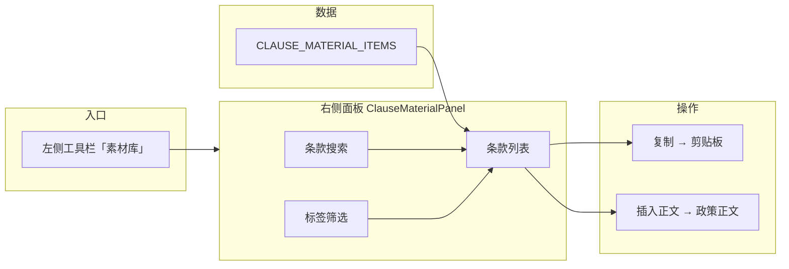

# 素材库引用 — 产品需求文档（PRD）

| 项目 | 说明 |
|------|------|
| 产品模块 | 政策起草 · 政策文件编辑页（`PolicyOutputPage`）· 素材库 |
| 版本 | v1.0（对应当前实现） |
| 更新日期 | 2026-06-03 |
| 关联代码 | `ClauseMaterialPanel.tsx`、`clauseMaterialLibrary.ts`、`PolicyOutputPage.tsx` |
| 关联页面 | `/reserve-library`「我的素材库」→「条款素材」Tab（数据源同源） |

---

## 1. 背景与目标

### 1.1 背景

政策起草过程中，起草人员常需引用历史政策中的**成熟条款表述**（如支持方向、补贴标准、申报条件等）。这些条款分散在「我的素材库」中维护；若在编辑正文时频繁跳转全屏素材库页，会打断写作节奏。

### 1.2 产品目标

在政策**文件编辑页**内提供「素材库」侧栏能力，使起草人员能够：

1. 浏览**条款素材**列表；
2. 通过关键词（及标签）**搜索/筛选**；
3. 将选中条款**插入正文**或**复制**到剪贴板备用。

### 1.3 范围说明

| 在范围内 | 不在范围内（v1） |
|----------|------------------|
| 条款素材的检索与展示 | 政策素材 Tab 内容 |
| 插入正文、复制 | 素材的新增、编辑、删除、批量操作 |
| 编辑页右侧 360px 面板 | 来源/地域/发文时间等筛选项（v1 已移除，仅关键词+标签） |
| 与全站素材库数据同源 | 插入到光标位置（v1 为文末追加） |

---

## 2. 用户与场景

| 角色 | 场景 |
|------|------|
| 政策起草人员 | 撰写「数据产业高质量发展政策起草稿」等正文时，从素材库挑选机器人/具身智能相关条款插入 |
| 核稿/润色人员 | 复制条款片段到其他文档或外部工具对照修改 |

**典型路径**：政策制定 → 政策起草 → 进入编辑页 → 左侧工具栏点击「素材库」→ 右侧面板操作 → 回到正文继续编辑。

---

## 3. 功能架构



---

## 4. 数据模型

### 4.1 条款素材项 `ClauseMaterialItem`

| 字段 | 类型 | 说明 | 列表展示 |
|------|------|------|----------|
| `content` | string | 条款全文（含「第×条」等公文表述） | 卡片主文案 |
| `source` | string | 入库来源，如「收藏入库」 | 元信息行 |
| `region` | string | 地域，如「北京市经济技术开发区」 | 与部门合并展示 |
| `department` | string | 发文/主管单位 | 与地域合并展示 |
| `publishDate` | string | 原政策发文日期 | 「发文 yyyy-mm-dd」 |
| `createdDate` | string | 加入素材库日期 | 「添加 yyyy-mm-dd」 |
| `tags` | string[] | 业务标签，如「具身智能」 | 卡片标签 Chip |

### 4.2 数据源

- 前端常量：`src/lib/clauseMaterialLibrary.ts` → `CLAUSE_MATERIAL_ITEMS`
- 与全站 **我的素材库 → 条款素材** 使用同一数组，避免编辑页与素材库页数据不一致
- v1 为内置示例数据；后续可改为接口拉取或本地存储同步

### 4.3 标签筛选项

`CLAUSE_MATERIAL_TAG_OPTIONS`：面板顶部可选标签（当前含「具身智能」「发文时间」）。

- 点击标签：**选中**则仅展示 `item.tags` 包含该标签的条款；再次点击取消筛选
- 「发文时间」为筛选项名称，**不**表示日期区间控件（编辑页已移除日期范围选择器）

---

## 5. 检索与筛选逻辑

### 5.1 条款搜索（已实现）

| 项 | 规则 |
|----|------|
| 触发 | 输入框 `onChange` 实时过滤 |
| 匹配字段 | 仅 `content`（条款正文子串匹配） |
| 匹配方式 | `keyword.trim()` 为空时不过滤关键词；非空时 `item.content.includes(q)` |
| 大小写 | 区分大小写（中文场景无影响） |

### 5.2 标签筛选（已实现）

| 项 | 规则 |
|----|------|
| 与搜索关系 | **且**关系：同时满足关键词条件与标签条件 |
| 未选标签 | `activeTag === null` 时不限制标签 |
| 选中标签 | `item.tags.includes(activeTag)` |

### 5.3 筛选能力（v1）

- **关键词**：实时匹配条款正文（`includes`）
- **标签**：`CLAUSE_MATERIAL_TAG_OPTIONS` 单选切换；与关键词为 **且** 关系
- v1 **不提供**来源、地域、发文时间区间等筛选项（卡片元信息仍展示来源/地域/日期，只读）

### 5.4 结果统计

- 文案：**共 {N} 条**，`N = filteredClauses.length`
- 无结果：展示空态「暂无匹配的条款素材」

---

## 6. 核心操作：复制与插入正文

### 6.1 复制

| 项 | 说明 |
|----|------|
| 入口 | 每条卡片右下角「复制」按钮（带 Copy 图标） |
| 行为 | `navigator.clipboard.writeText(item.content)` |
| 反馈 | 按钮文案 2 秒内变为「已复制」，随后恢复「复制」 |
| 作用范围 | 仅复制该条 `content` 全文，不含元信息 |
| 异常 | v1 未单独处理剪贴板权限失败（依赖浏览器默认行为） |

### 6.2 插入正文

| 项 | 说明 |
|----|------|
| 入口 | 每条卡片右下角主按钮「插入正文」（主题色） |
| 回调 | `ClauseMaterialPanel` → `onInsert(content)` → `PolicyOutputPage.handleInsertClauseMaterial` |
| 逻辑 | 见下表 |

**插入算法（v1）**

```
trimmed = clauseText.trim()
若 trimmed 为空 → 不操作

current = 当前政策正文（fullContentRef 或 displayedText）去掉首尾空白

若 current 非空：
  next = current + "\n\n" + trimmed
否则：
  next = trimmed

写回 fullContentRef 与 displayedText，左侧编辑区即时刷新
```

| 特性 | 说明 |
|------|------|
| 插入位置 | **正文末尾**追加，段落之间空一行 |
| 光标 | 不定位到插入段；不替换选区 |
| 多次插入 | 按操作顺序依次追加 |
| 与复制关系 | 独立操作；插入不自动复制 |

**v2 建议**：支持光标处插入、选区替换、插入后滚动定位。

---

## 7. 交互说明

### 7.1 入口与面板

| 项 | 说明 |
|----|------|
| 入口 | 编辑页左侧竖向工具栏，**素材库**（`FolderOpen` 图标），位于「生成条款」与「政策自评估」之间 |
| 展开 | 点击后 `activePanel = "material"`，**右侧**滑出宽 360px 面板（与审稿核稿、参考来源等一致） |
| 收起 | 再次点击「素材库」或切换其他工具，`activePanel` 切换/置空，面板关闭 |
| 动画 | `AnimatePresence` + 宽度过渡约 0.25s |

### 7.2 面板结构（自上而下）

```
┌─────────────────────────────────────┐
│ 素材库                               │
│ 条款素材，可搜索、筛选并插入政策正文   │
├─────────────────────────────────────┤
│ 条款搜索 [________________🔍]       │
│ 标签  [具身智能] …                   │
│ ─────────────────────────────────   │
│ 共 N 条                             │
├─────────────────────────────────────┤
│ ┌ 条款卡片 ─────────────────────┐   │
│ │ 第六条 …（全文）                │   │
│ │ [具身智能]                     │   │
│ │ 来源 / 地域·部门 / 发文·添加    │   │
│ │              [复制] [插入正文]  │   │
│ └───────────────────────────────┘   │
│ … 更多卡片（可滚动）                 │
└─────────────────────────────────────┘
```

### 7.3 与全屏「我的素材库」的关系

| 对比项 | 编辑页「素材库」面板 | `/reserve-library` 全页 |
|--------|----------------------|-------------------------|
| 内容类型 | 仅条款素材 | 政策素材 + 条款素材 + 我的收藏 |
| 搜索 | 关键词 + 标签 | 条款 Tab 含更多筛选项（地域、发文时间区间等） |
| 操作 | 复制、插入正文 | 批量、添加、加入分析等 |
| 数据 | `CLAUSE_MATERIAL_ITEMS` | 同源条款数组 |

用户在全页维护素材后，v1 需发版更新常量或后续改为 API 同步。

### 7.4 编辑页布局示意

```
[左侧主导航] | [工具栏 132px] | [政策正文编辑区 flex-1] | [素材库面板 360px]
```

---

## 8. 界面状态

| 状态 | 条件 | 展示 |
|------|------|------|
| 默认列表 | 无搜索、无标签 | 展示全部 `CLAUSE_MATERIAL_ITEMS` |
| 筛选中 | 有关键词和/或标签 | 列表实时缩减，统计 N 更新 |
| 空结果 | 过滤后 0 条 | 虚线框空态文案 |
| 复制成功 | 点击复制后 2s 内 | 该卡片按钮显示「已复制」 |

---

## 9. 非功能需求

| 类型 | 要求 |
|------|------|
| 性能 | 本地数组过滤，百级数据内即时响应 |
| 兼容 | 复制依赖 HTTPS 或 localhost 下的 Clipboard API |
| 可访问 | 按钮需可键盘聚焦（v1 为基础 button 元素） |

---

## 10. 验收标准

### 10.1 入口与展示

- [ ] 编辑页左侧工具栏可见「素材库」，点击后右侧弹出面板
- [ ] 面板标题为「素材库」，副标题说明条款素材用途
- [ ] 默认展示 2 条示例条款（具身智能相关），含标签与元信息

### 10.2 搜索与筛选

- [ ] 搜索「机器人」可命中含该词的条款
- [ ] 点击「具身智能」标签仅显示带该标签的条款；再次点击恢复
- [ ] 搜索 + 标签组合为且关系
- [ ] 无匹配时显示「暂无匹配的条款素材」，统计为 0

### 10.3 复制

- [ ] 点击「复制」后剪贴板内容为该条全文
- [ ] 按钮短暂显示「已复制」

### 10.4 插入正文

- [ ] 空正文时插入一条，编辑区仅显示该条款
- [ ] 已有正文时插入，新条款在文末且与前文空一行
- [ ] 连续插入两条，顺序与操作顺序一致

### 10.5 回归

- [ ] 关闭素材库面板后正文内容保留
- [ ] 切换至其他工具再返回，可再次打开面板

---

## 11. 版本规划

| 版本 | 内容 |
|------|------|
| v1.0 | 当前：条款列表、搜索、标签、复制、文末插入、右侧面板 |
| v1.1 | 来源筛选实装；标签与「发文时间」筛选项语义拆分 |
| v1.2 | 光标处插入、插入后定位滚动 |
| v2.0 | 对接素材库 API；编辑页新增/收藏条款与全站同步 |

---

## 附录 A：示例条款摘要（当前内置数据）

| 序号 | 标签 | 内容摘要 |
|------|------|----------|
| 1 | 具身智能 | 第六条：机器人高水平制造、人形机器人中试产线、销售额 10% 补助等 |
| 2 | 具身智能 | 第四条：机器人推广应用、场景补贴 30%/20%、单项目最高 500 万元 |

---

## 附录 B：关键代码索引

| 能力 | 位置 |
|------|------|
| 工具栏注册 | `PolicyOutputPage` → `editorTools`，`id: "material"` |
| 插入正文 | `handleInsertClauseMaterial` |
| 面板 UI | `ClauseMaterialPanel` |
| 数据 | `clauseMaterialLibrary.ts` → `CLAUSE_MATERIAL_ITEMS` |

---

*文档依据仓库根目录当前实现整理；功能变更请同步更新本 PRD。*
